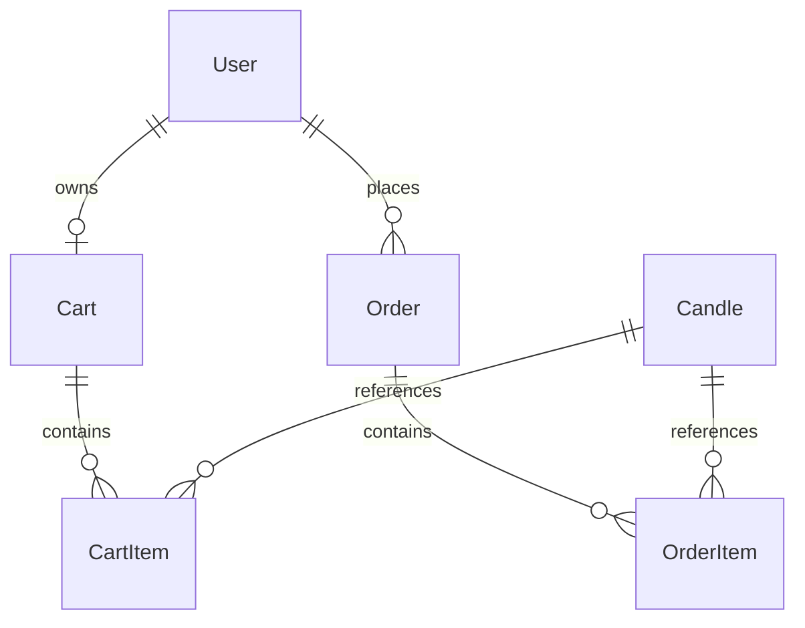

# Moonlight Flame — Complete Backend Audit

## 1. Executive Summary
This document provides a comprehensive, code-level backend and business logic audit of the Moonlight Flame Django application. The system is designed to facilitate the sale of handcrafted candles, supporting cart creation, product listings, user accounts, and a full checkout lifecycle. While the frontend and visual passes have refined the customer experience, this audit identifies critical design constraints, database race conditions, missing input sanitization patterns, and potential transaction safety risks that must be resolved before the site is deployed to a production environment.

Key areas of concern include a susceptibility to database deadlocks under concurrent checkout requests, lack of validation checks on key fields like phone numbers and email addresses at the database insertion level, and critical cascade deletion behaviors on historical order data. 

---

## 2. Current Architecture
The Moonlight Flame backend is built on Django 6.0.3 and SQLite (in development). It uses a standard Model-View-Template (MVT) pattern, supplemented by AJAX JSON endpoints for cart interactions and checkout submissions.

### Request Flow (Standard HTML Views)
```
Browser (HTTP GET)
  ↳ Django URL Router (urls.py)
    ↳ View Function (views.py)
      ↳ Authentication Decorator (e.g. login_required)
        ↳ Database Query (Model Layer)
          ↳ Render HTML Template (using context)
            ↳ Response to Client (200 OK)
```

### AJAX/API Request Flow (Cart & Checkout Operations)
```
Frontend JS (fetch POST)
  ↳ Django URL Router (urls.py)
    ↳ View Function (views.py)
      ↳ Custom wrapper check (@_auth_json_required)
        ↳ CSRF Token Verification (Middleware Layer)
          ↳ JSON Payload Parse (_json_body)
            ↳ Business Logic & DB Transactions (atomic block)
              ↳ JSON Response (success/error state + data payload)
```

---

## 3. Complete Project Structure
The Moonlight Flame repository consists of two main Django apps under a master configuration project named `candle`:

```
Moonlight-Flame/
├── manage.py                  # Django administrative script
├── db.sqlite3                 # SQLite Database file
├── requirements.txt           # Project package dependencies
├── Templates/                 # Global template folders
│   ├── home/
│   │   ├── candle.html        # Homepage with product listing & cart overlays
│   │   └── orders.html        # User order history
│   └── accounts/
│       ├── login.html         # User sign-in card
│       ├── register.html      # Account creation card
│       ├── terms.html         # Terms of Service
│       └── privacy.html       # Privacy policy
├── candle/                    # Configuration Project Folder
│   ├── __init__.py
│   ├── settings.py            # Global settings (static, media, database, apps)
│   ├── urls.py                # Core URL router
│   ├── wsgi.py / asgi.py      # Server entry points
│   └── views.py               # Minimal default routes
├── store/                     # Main Store App
│   ├── admin.py               # Model registration for admin panel
│   ├── apps.py                # Store App Config
│   ├── models.py              # Candle, Cart, CartItem, Order, OrderItem models
│   ├── urls.py                # Store routes (cart API and checkout actions)
│   └── views.py               # Cart operations, calculations, checkout transaction
└── accounts/                  # User accounts App
    ├── admin.py
    ├── apps.py
    ├── urls.py                # Register, login, logout, terms routes
    └── views.py               # Authentication views (session login/logout, create user)
```

---

## 4. Database Architecture
The database schema consists of standard relational tables managed via Django's ORM:



---

## 5. Model-by-Model Analysis

### A. Candle
- **Purpose:** Represents a standalone product item (scented candle).
- **Fields:**
  - `name`: `CharField(max_length=200)`. Required.
  - `description`: `TextField()`. Required.
  - `price`: `DecimalField(max_digits=10, decimal_places=2)`. Required.
  - `stock`: `PositiveIntegerField(default=0)`. Required. Prevents negative stock at model definition level, but doesn't prevent database-level decreases beyond zero unless locked.
  - `image`: `ImageField(upload_to="candles/")`. Required.
  - `category`: `CharField(max_length=100, default="General")`.

### B. Cart
- **Purpose:** Associates a unique shopping cart session with a registered user.
- **Fields:**
  - `user`: `OneToOneField(User, on_delete=models.CASCADE)`. If user is deleted, cart is cascade-deleted.
  - `created_at`: `DateTimeField(auto_now_add=True)`.

### C. CartItem
- **Purpose:** Represents individual products added to a user's cart.
- **Fields:**
  - `cart`: `ForeignKey(Cart, on_delete=models.CASCADE, related_name="items")`.
  - `candle`: `ForeignKey(Candle, on_delete=models.CASCADE)`.
  - `quantity`: `PositiveIntegerField(default=1)`.
- **Database Constraints:** `UniqueConstraint(fields=["cart", "candle"], name="unique_cart_candle")` prevents duplicate items of the same product in a single cart.

### D. Order
- **Purpose:** Stores customer delivery information, payments, and billing details.
- **Fields:**
  - `user`: `ForeignKey(User, on_delete=models.CASCADE, related_name="orders")`. **Risk:** Cascade deletion of orders.
  - `created_at` / `updated_at`: `DateTimeField`.
  - `subtotal` / `shipping_cost` / `total_price`: `DecimalField(max_digits=10, decimal_places=2)`.
  - `payment_method`: `CharField` (choices: UPI, Card, Netbanking, COD).
  - `payment_status`: `CharField` (default "Pending").
  - `status`: `CharField` (choices: Processing, Shipped, Delivered, Cancelled).
  - Delivery details: `first_name`, `last_name`, `email`, `phone`, `address1`, `address2`, `city`, `state`, `pincode`.

### E. OrderItem
- **Purpose:** Stores historical item purchase snapshots.
- **Fields:**
  - `order`: `ForeignKey(Order, on_delete=models.CASCADE, related_name="items")`.
  - `candle`: `ForeignKey(Candle, on_delete=models.SET_NULL, null=True, blank=True)`. Prevents cascade deletion of purchase logs when a product is deleted.
  - `candle_name`: `CharField(max_length=200)`. Stores name snapshot.
  - `unit_price`: `DecimalField(max_digits=10, decimal_places=2)`. Stores price snapshot.
  - `quantity`: `PositiveIntegerField(default=1)`.

---

## 6. Product & Inventory Logic
- **Stock Depletion:** Handled during checkout. Stock is verified against request limits. If sufficient, `candle.stock` is decremented and saved.
- **Out of stock behavior:** If stock is `0`, `add_to_cart` returns a `400` error. If stock drops below cart quantities prior to checkout, the checkout transaction reverts and rejects the order.
- **Product deletion behavior:** If a candle is deleted, `OrderItem.candle` is set to `NULL` (`on_delete=models.SET_NULL`). The order record remains accurate because `candle_name` and `unit_price` are stored as hard snapshots.
- **Overselling risk:** Safe at the checkout database level due to row locking (`select_for_update`). However, concurrency deadlocks can still occur due to unsorted lock acquisition.

---

## 7. Cart Architecture & Flow
```
Add to Cart:
  Fetch Candle ➔ Check stock > 0 ➔ get_or_create CartItem ➔ Check quantity <= stock ➔ Save CartItem ➔ Return JSON count

Update Cart:
  Fetch Cart ➔ Fetch CartItem ➔ Check new quantity <= stock ➔ If quantity <= 0: Delete CartItem, Else: Save CartItem ➔ Return JSON payload
```

**Out-of-sync carts:** If a product is updated (price changes or goes out of stock), the user's cart continues to hold the item. The cart payload retrieves the live `price` and `stock` dynamically, but quantity checks only trigger again during checkout.

---

## 8. Checkout Architecture & Flow
The checkout flow is handled entirely inside a database transaction block:

```
POST /checkout/
  ➔ Validate required body fields (firstName, phone, email, etc.)
  ➔ Validate payment method choices
  ➔ Fetch user Cart
  ➔ Open transaction.atomic():
      ↳ Fetch CartItem relations
      ↳ Loop through items and lock Candle rows using select_for_update()
      ↳ Verify stock >= requested quantity
      ↳ Calculate subtotal, standard shipping fee, and COD handling fee
      ↳ Create Order record
      ↳ Loop items: Create OrderItem snapshots and decrement Candle.stock
      ↳ Clear all CartItem rows for this Cart
  ➔ Return JSON order confirmation
```

---

## 9. Order Architecture & Flow
Orders are created with a default status of `Processing` and payment status of `Pending`.
- **Admin Visibility:** Orders and their line items are visible in the Django admin dashboard.
- **Integrity snapshots:** `OrderItem` correctly isolates itself from modifications to the original `Candle` objects by duplicating `candle_name` and `unit_price` fields.

---

## 10. Authentication Architecture
- Built on Django's default authentication system (`django.contrib.auth.models.User`).
- **Registration:**
  - Performs custom password match and length check.
  - Utilizes Django's standard `validate_password` validator to enforce complexity.
  - Username uniqueness is checked using an case-insensitive filter (`username__iexact`).
- **Session management:** Uses Django session cookies. Logs out via a POST request (`user_logout`) to protect against CSRF logout triggers.

---

## 11. API/AJAX Endpoint Audit

| Endpoint | Method | Auth | Ownership | CSRF | Input Validation | DB Operations | Response | Risk |
| :--- | :--- | :--- | :--- | :--- | :--- | :--- | :--- | :--- |
| `/add-to-cart/<int:id>/` | POST | Yes | User owns cart | Yes | Yes (digits only) | get_or_create, save | JSON (item count) | High stock concurrency window |
| `/update-cart/<int:id>/` | POST | Yes | User owns cart | Yes | Yes (integer format) | update, delete | JSON (items array) | Standard race condition |
| `/remove-from-cart/<id>/`| POST | Yes | User owns cart | Yes | No (URL integer) | delete | JSON (success state) | Minimal |
| `/clear-cart/` | POST | Yes | User owns cart | Yes | No | delete | JSON (success state) | Minimal |
| `/get-cart/` | GET | No | Returns empty if anonymous | No | No | select_related select | JSON (items array) | Information leak if sessions bleed |
| `/checkout/` | POST | Yes | User owns cart | Yes | Empty check only | select_for_update, write, delete | JSON (order info) | Concurrency deadlocks & duplicate checkouts |

---

## 12. Input Validation Audit
- **Client-side validation:** Enforced via basic HTML5 attributes (`required`, `type="email"`).
- **Server-side validation:** 
  - Checks only presence/whitespace of fields during checkout (`firstName`, `email`, `phone`, etc.).
  - Email format validity is not validated using validators prior to DB insertion.
  - Phone numbers are saved as raw strings, enabling malicious text or script payloads to enter.
- **Database validation:** Schema does not enforce regex checks.

---

## 13. CSRF & Security Audit
- Django `CsrfViewMiddleware` is globally active.
- State-changing actions (`add-to-cart`, `checkout`, `logout`) are properly locked behind POST requests and require valid `X-CSRFToken` header values.

---

## 14. Settings & Production Security Audit
- **DEBUG:** Read from environment variable, defaults to `True` if not configured. **Risk:** Information leak in production if environment variables are missing.
- **SECRET_KEY:** Uses a fallback default (`"dev-only-change-me"`). **Critical Risk** if deployed without environment config.
- **SECURE_COOKIES:** Enforced conditionally based on `DJANGO_SECURE_COOKIES` environment configurations.

---

## 15. Media/File Security Audit
- Candles are registered via the Django admin dashboard. Media file uploads (`candles/`) are handled exclusively by authenticated admin staff, minimizing the threat of public shell upload vulnerabilities.

---

## 16. Data Integrity Audit
- **Cascade Deletion Threat:** Deleting a `User` cascades to delete all their historical `Order` logs. This violates financial audit trails.
- **Negative stock prevention:** Standard model check (`PositiveIntegerField`) prevents values under zero, but concurrent updates bypassing transactions could raise database validation crashes.

---

## 17. Concurrency/Race Condition Audit

### Scenario A: Two users buy the final candle simultaneously.
- **Status:** **Safe**.
- **Reason:** `select_for_update()` locks the respective Candle row inside a transaction block, ensuring only one transaction decrements the stock first. The second transaction wakes up, reads the updated stock (`0`), fails the validation, and rolls back safely.

### Scenario B: Concurrent checkout requests by the same user.
- **Status:** **Unsafe (Duplicate Order Risk)**.
- **Reason:** Since `cart_items = list(_cart_items(cart))` is evaluated *before* row locks are acquired, both threads read the populated cart. Thread 1 locks, processes, and commits. Thread 2 then locks, sees the items in memory, passes stock checks (if stock is sufficient), and writes a second duplicate order.

### Scenario C: Unsorted row locks.
- **Status:** **Unsafe (Deadlock Risk)**.
- **Reason:** Locks are acquired based on the order cart items were added. Concurrently checking out overlapping products can freeze database connections with a deadlock.

---

## 18. Error Handling Audit
- AJAX routes catch validation errors and return `400` status codes with structured JSON error messages.
- If a server exception occurs inside `transaction.atomic()`, database changes are cleanly rolled back, ensuring no orphan order or stock updates exist.

---

## 19. Performance Audit
- `get_cart` and `checkout` fetch item counts efficiently.
- `orders` view correctly utilizes `prefetch_related("items")`. No N+1 database queries occur during order history rendering.

---

## 20. Frontend ↔ Backend Contracts
- Handled via `products_json` injection on the homepage, and standardized JSON payloads for cart sync operations.
- Endpoint changes require careful alignment to prevent JavaScript errors.

---

## 21. Code Quality & Maintainability
- Concerns are separated between apps.
- Checkout view contains nested database operations and logic (shipping fees, COD fee rules) that would be cleaner if refactored into model manager or service helper classes.

---

## 22. Existing Test Coverage
- There are no active test modules (`store/tests.py` and `accounts/tests.py` contain empty templates). The test coverage is **0%**.

---

## 23. Bugs & Vulnerabilities
- **Bug 1:** Unsorted checkout locks leading to database deadlocks.
- **Bug 2:** Simultaneous duplicate checkouts creating multiple orders from a single cart.
- **Bug 3:** Order cascade deletion upon user profile removal.
- **Bug 4:** Unsanitized email, phone, and pincode strings saved directly to the database.

---

## 24. Severity Matrix

| ID | Issue | Severity | Target Area |
| :--- | :--- | :--- | :--- |
| BG-01 | Unsorted Lock Deadlocks | **HIGH** | `store/views.py` |
| BG-02 | Duplicate Checkout Requests | **HIGH** | `store/views.py` |
| BG-03 | Order Cascade Deletion | **HIGH** | `store/models.py` |
| BG-04 | Missing Email & Phone Validation | **MEDIUM** | `store/views.py` |
| BG-05 | Missing Rate Limiting / Brute-Force Protection | **MEDIUM** | `accounts/views.py` |
| BG-06 | Hardcoded Configuration Constants | **LOW** | `store/views.py` |

---

## 25. Recommended Architecture
Refactor the checkout and cart operations into a Service layer (`store/services.py`) to keep views thin. Introduce form-based validation or model cleaners to sanitize delivery fields before saving.

---

## 26. Prioritized Fix Roadmap

### Phase 1 — Financial & Transaction Safety
- Resolve database lock deadlocks by sorting query IDs.
- Introduce user-level cart locks at the beginning of the checkout transaction to prevent duplicate orders.

### Phase 2 — Data Archival Integrity
- Change `user` relationship on `Order` to prevent cascade deletions.

### Phase 3 — Input Validation
- Validate phone formatting, pincodes, and email structures on the backend.

---

## 27. Recommended Test Plan
1. **Concurrency Tests:** Run multi-threaded scripts simulating concurrent checkouts to ensure no deadlocks or duplicate orders occur.
2. **Validation Tests:** Assert that invalid emails/phones fail checkout with validation errors.
3. **Cascade Tests:** Delete a user account in a test database and assert that order records remain intact.

---

## 28. Production Readiness Score
- **Architecture:** 7/10
- **Security:** 6/10
- **Authentication:** 8/10
- **Cart Reliability:** 7/10
- **Checkout Reliability:** 5/10
- **Inventory Integrity:** 8/10
- **Order Integrity:** 5/10
- **API Design:** 7/10
- **Performance:** 8/10
- **Maintainability:** 6/10
- **Testing:** 0/10
- **Production Readiness Score: 62/100**

---

## 29. Decisions Required From Me
1. **User Deletion Strategy:** Do we protect orders from deletion, or set user to `NULL` to keep them anonymous?
2. **Verification Constraints:** Do we want strict validation for phone (exactly 10 digits) and PIN code (exactly 6 digits)?

---

## TOP 10 BACKEND FIXES

### 1. Unsorted Row Locks during Checkout
- **Problem:** Database locks on Candles are acquired in arbitrary order, causing deadlocks under heavy concurrent checkout loads.
- **Evidence:** `store/views.py` lines 189-191.
- **Severity:** **HIGH**.
- **Business Impact:** Failed checkouts, hung database connections, customer friction.
- **Security Impact:** Potential Denial of Service (DoS) vulnerability.
- **Recommended Solution:** Sort cart items by `candle_id` before querying `select_for_update()`.
- **Files Affected:** `store/views.py`
- **Migration Required:** No.
- **Testing Required:** Concurrent requests simulation.
- **Dependencies:** None.

### 2. Duplicate Checkout Submissions
- **Problem:** Simultaneous checkout requests bypass cart clearance checks because the cart items list is evaluated before row locks are acquired.
- **Evidence:** `store/views.py` lines 181-190.
- **Severity:** **HIGH**.
- **Business Impact:** Double-charging customers, creating duplicate shipments.
- **Security Impact:** Financial integrity risks.
- **Recommended Solution:** Lock the user's `Cart` row using `select_for_update()` at the start of the transaction before reading cart items.
- **Files Affected:** `store/views.py`
- **Migration Required:** No.
- **Testing Required:** Double-click checkout simulation.
- **Dependencies:** None.

### 3. Historical Order Cascade Deletion
- **Problem:** Deleting a User account cascades to delete their entire order history, destroying financial logs.
- **Evidence:** `store/models.py` line 53.
- **Severity:** **HIGH**.
- **Business Impact:** Loss of compliance records, failed financial audits.
- **Security Impact:** Loss of data.
- **Recommended Solution:** Set `on_delete=models.PROTECT` or allow nullable users with `models.SET_NULL`.
- **Files Affected:** `store/models.py`
- **Migration Required:** Yes.
- **Testing Required:** User deletion tests.
- **Dependencies:** None.

### 4. Missing Delivery Contact validations
- **Problem:** Unchecked email/phone values are written directly to database fields without validation.
- **Evidence:** `store/views.py` lines 210-219.
- **Severity:** **MEDIUM**.
- **Business Impact:** Undeliverable packages, customer support overhead.
- **Security Impact:** Database storage pollution.
- **Recommended Solution:** Add regex and email structure checks in checkout views before writing orders.
- **Files Affected:** `store/views.py`
- **Migration Required:** No.
- **Testing Required:** Validation failure tests.
- **Dependencies:** None.

### 5. Missing Auth Rate-Limiting
- **Problem:** Login and registration endpoints are vulnerable to automated brute-force attempts.
- **Evidence:** `accounts/views.py` views.
- **Severity:** **MEDIUM**.
- **Business Impact:** High server overhead, password guessing risks.
- **Security Impact:** Account takeover vulnerability.
- **Recommended Solution:** Integrate rate-limiting handlers on auth endpoints.
- **Files Affected:** `accounts/views.py`
- **Migration Required:** No.
- **Testing Required:** Rapid login attack simulation.
- **Dependencies:** None.

### 6. Fallback SECRET_KEY handling
- **Problem:** Production environment uses a hardcoded fallback secret key if not set.
- **Evidence:** `candle/settings.py` line 24.
- **Severity:** **MEDIUM**.
- **Business Impact:** Compromised session token hashes.
- **Security Impact:** Encryption bypass vulnerability.
- **Recommended Solution:** Raise `ImproperlyConfigured` exception in settings if `DJANGO_SECRET_KEY` environment variable is not defined when `DEBUG=False`.
- **Files Affected:** `candle/settings.py`
- **Migration Required:** No.
- **Testing Required:** Environment boot checks.
- **Dependencies:** None.

### 7. Hardcoded Business Constants
- **Problem:** Shipping cost, thresholds, and COD fees are hardcoded inside views.
- **Evidence:** `store/views.py` lines 14-16.
- **Severity:** **LOW**.
- **Business Impact:** Inflexible business rules. Changing values requires code redeployments.
- **Recommended Solution:** Move Constants to project `settings.py` or a database configuration model.
- **Files Affected:** `store/views.py`, `candle/settings.py`
- **Migration Required:** No.
- **Testing Required:** Verification of dynamic calculations.
- **Dependencies:** None.

### 8. Lacking Unit and Integration Tests
- **Problem:** There are no tests to prevent regressions on checkout or inventory transactions.
- **Evidence:** `store/tests.py`, `accounts/tests.py`.
- **Severity:** **LOW**.
- **Business Impact:** High risk of breaking features during subsequent code changes.
- **Recommended Solution:** Build a robust test suite covering checkout transactions, cart updates, and login validations.
- **Files Affected:** `store/tests.py`, `accounts/tests.py`
- **Migration Required:** No.
- **Testing Required:** Suite execution.
- **Dependencies:** None.

### 9. Hardcoded Pincode Deliveries check
- **Problem:** Frontend shows "Available in select pincodes only" for COD, but the backend accepts COD for any pincode.
- **Evidence:** `store/views.py` checkout handler.
- **Severity:** **LOW**.
- **Business Impact:** Orders placed to non-serviceable COD areas, leading to transit losses.
- **Recommended Solution:** Implement backend blacklist/whitelist pincode checks.
- **Files Affected:** `store/views.py`
- **Migration Required:** No.
- **Testing Required:** Checkout pincode validation tests.
- **Dependencies:** None.

### 10. Apple-Touch-Icon size inconsistency
- **Problem:** Favicon configuration uses standard paths but doesn't handle all responsive client queries in header sections.
- **Evidence:** Global HTML templates head sections.
- **Severity:** **LOW**.
- **Business Impact:** Minor display irregularities on certain client bookmarks.
- **Recommended Solution:** Uniformly standardise modern viewport icons across all pages.
- **Files Affected:** HTML Templates.
- **Migration Required:** No.
- **Testing Required:** Visual bookmarks inspection.
- **Dependencies:** None.
